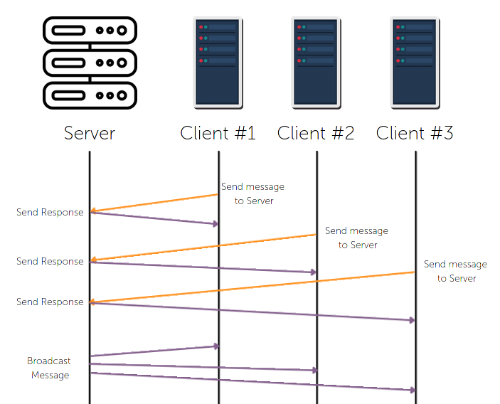

# UDP Network Socket Protocol



## Installation
```
git clone https://github.com/mangledbottles/Network-Socket-Protocol.git
cd Network-Socket-Protocol
npm i
```
## Usage

### Server
There can only be one server
```
npm run server
```

### Dockerizing Server
Build an image from a Dockerfile and run in a new container
```docker
docker build .
docker run -i -p 8080:8080/udp [IMAGE_ID]
```
- -i parameter allows the user to **work with IO inside the Docker container** for Server Broadcasting
- -p parameter exposes the port 8080 for UDP use (see [Dockerfile](./Dockerfile))
- [IMAGE_ID] is the build ID that is run in the second command

> 
> 

### Client
There can be many clients
```
npm run client
```
> 
> Starting the Client sends a message to the Server and the Server response with the current time

# Topology
## Dockerfile
This project has been [dockerized](./Dockerfile)
> 

## Server.ts
The Server.ts file contains 4 main functionalities
1. Create UDP server with the dgram library
2. Read user IO from the CLI
3. Listen to incomining messages from Clients
4. Send messages to Client(s)

## Broadcasting
The Server can send a message to all Clients. The user types into the CLI and the Server manages the IO and broadcasts the message to all connected Clients. To broadcast a message to all Clients, run the Docker container ([as seen above](#dockerizing-server)), then type a message into the CLI and press enter.
> 
> When a Client connects to the Server, their address and port are saved. When a broadcast is called, the message is sent to all addresses and ports connected. An Typescript interface has been created for Client and all Client's are stored in a Set to prevent duplicates.

## Client.ts
The Client.ts file connects to the Server, sends a message to the Server and listens for messages from the Server.

## Wireshark
[Wireshark](https://www.wireshark.org/) is a network packet analyzer.

Sample intercepted request (taken from [Wireshark PCAP File](./Misc/2ClientsConnectToServerAndServerBroadcast.pcapng))


| No. | Time | Source | Destination | Protocol | Length | Info |
| --- | ---- | ------ | ----------- | -------- | ------ | ---- |
| 2 | 0.010357778 | 127.0.0.1 | 127.0.0.1 | UDP | 137  | 8080 → 60137 Len=95 |

---
| Hexadecimal Payload | Base10 Decoded |
|-|-|
| 0000  48 65 6c 6c 6f 20 33 35 35 39 31 2c 20 79 6f 75  |  Hello 35591, you |
| 0010 20 61 72 65 20 23 30 2c 20 74 69 6d 65 20 69 73   | are #0, time is |
| 0020  20 54 75 65 20 4f 63 74 20 32 36 20 32 30 32 31  |  Tue Oct 26 2021 |
| 0030  20 31 38 3a 32 35 3a 35 34 20 47 4d 54 2b 30 30  |  18:25:54 GMT+00 |
| 0040  30 30 20 28 43 6f 6f 72 64 69 6e 61 74 65 64 20  | 00 (Coordinated |
| 0050  55 6e 69 76 65 72 73 61 6c 20 54 69 6d 65 29     | Universal Time) |

This is one request taken from the PCAP file which intercepted a message from the Server to the Client sending the current date. The payload is send in hexadecimal format. In the Info tab, you can see the request is being sent from port 8080 (Server) to port 60137 (generated port for given Client).